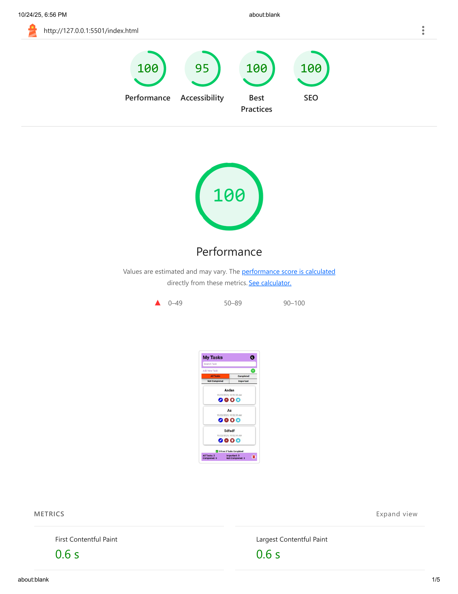

# ToDo App

A **dynamic, responsive, and modern ToDo application** built with **HTML, CSS, and JavaScript**.  
Designed to help users manage their tasks efficiently with support for filtering, dark mode, and progress tracking.

---

🚀 Live Demo

👉 [https://github.com/ahmednabil22224/ToDo-app.git](https://ahmednabil22224.github.io/ToDo-app/)

---

## 🔹 Features

- **Add, Update, Delete Tasks**
- **Mark Tasks as Completed / Not Completed**
- **Mark Tasks as Important**
- **Search Tasks by Title**
- **Filter Tasks**:
  - All Tasks
  - Completed Tasks
  - Not Completed Tasks
  - Important Tasks
- **Dark Mode** toggle
- **Progress Bar** showing task completion
- **Responsive Design** for all screen sizes
- **Overlay Messages & Toast Notifications** for user actions
- **LocalStorage Support** to save tasks persistently

---

## 💻 Technologies Used

- **HTML5**
- **CSS3** (Flexbox, Grid, CSS Variables, Media Queries)
- **JavaScript (ES6+)**
- **FontAwesome** for icons

---

Project Structure:

````
todo-app/
│
├─ index.html
├─ README.md
├─ css/
│ ├─ normalize.css
│ └─ style.css
├─ js/
│ ├─ app.js
│ ├─ storageData.js
│ ├─ tasksList.js
│ ├─ lineTask.js
│ └─ components/
│   ├─ header.js
│   ├─ footer.js
│   └─ overlay.js
└─ images/
  ├─ logo/
  └─ screenshots/

---

## Dark Mode:

The app uses CSS variables to switch between light and dark themes.
The selected theme is saved in localStorage so it persists across sessions.

---

## How It Works

. Tasks are stored in localStorage for persistenc

. Task filtering and progress bar update dynamically

. Confirmation overlays prevent accidental deletion or update

. Toast notifications provide user feedback

---

## ⚙️ Installation / Usage

1. Clone the repository:

```bash
   git clone https://github.com/ahmednabil22224/ToDo-app.git
````

2. Navigate into the project folder:
   cd todo-app

3.⚠️ Important:

This app uses JavaScript features like localStorage and URL hash routing.
It will not work correctly if opened directly from the file system (e.g., by double-clicking index.html).

You must run it through a local development server.

4.Start a local server:

. If you have VS Code, use the Live Server extension and click “Go Live”.

. Or, use one of these commands from the project folder:

      # Option 1: Using Python (built-in server)
      python -m http.server 5500

      # Option 2: Using Node.js
      npx serve

5.Open in browser:
http://localhost:5500

---

## 🌟 Lighthouse Report

| Metric            | Score |
| ----------------- | ----- |
| ⚡ Performance    | 100%  |
| ♿ Accessibility  | 95%   |
| 🛡️ Best Practices | 100%  |
| 🔍 SEO            | 100%  |

images/lighthouse-report.png

## ⚡ Lighthouse Report



---

## 📸 Screenshots

### 🖥️ Desktop


### 📱 Tablet


### 📱 Mobile


